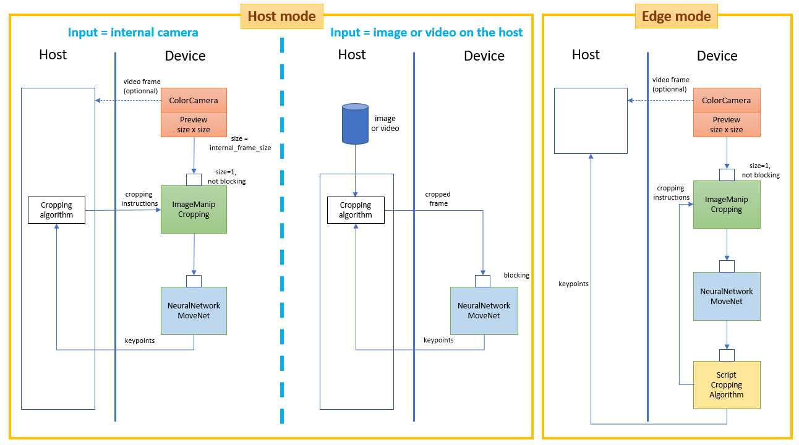

# MoveNet Single Pose tracking on DepthAI

Running Google MoveNet Single Pose models on [DepthAI](https://docs.luxonis.com/en/latest/) hardware (OAK-1, OAK-D,...).

A convolutional neural network model that runs on RGB images and predicts [human joint
locations](https://github.com/tensorflow/tfjs-models/tree/master/pose-detection#coco-keypoints-used-in-movenet-and-posenet) of a single person. Two variant: Lightning and Thunder, the latter being slower but more accurate.
MoveNet uses a smart cropping based on detections from the previous frame when the input is a sequence of frames. This allows the model to devote its attention and resources to the main subject, resulting in much better prediction quality without sacrificing the speed.


For MoveNet on OpenVINO, please visit : [openvino_movenet](https://github.com/geaxgx/openvino_movenet)


## Architecture: Host mode vs Edge mode
The cropping algorithm determines from the body detected in frame N, on which region of frame N+1  the inference will run. The mode (Host or Edge) describes where this algorithm runs :
- in Host mode, the cropping algorithm runs on the host cpu. Only this mode allows images or video files as input. The flow of information between the host and the device is bi-directional: in particular, the host sends frames or cropping instructions to the device;
- in Edge mode, the cropping algorithm runs on the MyriadX. So, in this mode, all the functional bricks of MoveNet (inference, determination of the cropping region for next frame, cropping) are executed on the device. The only information exchanged are the body keypoints and optionally the camera video frame.

Note: in either mode, when using the color camera, you can choose to disable the sending of the video frame to the host, by specifying "rgb_laconic" instead of "rgb" as input source.

 

## Install

Install the python packages DepthAI, Opencv with the following command:
```
python3 -m pip install -r requirements.txt
```

## Run

**Usage:**

```
> python3 demo.py -h                                               
usage: demo.py [-h] [-e] [-m MODEL] [-i INPUT] [-c] [-nsc]
               [-s SCORE_THRESHOLD] [-f INTERNAL_FPS]
               [--internal_frame_height INTERNAL_FRAME_HEIGHT] [-o OUTPUT]

optional arguments:
  -h, --help            show this help message and exit
  -e, --edge            Use Edge mode (the cropping algorithm runs on device)
  -m MODEL, --model MODEL
                        Model to use : 'thunder' or 'lightning' or path of a
                        blob file (default=thunder)
  -i INPUT, --input INPUT
                        'rgb' or 'rgb_laconic' or path to video/image file to
                        use as input (default=rgb)
  -c, --crop            Center cropping frames to a square shape (smaller size
                        of original frame)
  -nsc, --no_smart_crop
                        Disable smart cropping from previous frame detection
  -s SCORE_THRESHOLD, --score_threshold SCORE_THRESHOLD
                        Confidence score to determine whether a keypoint
                        prediction is reliable (default=0.200000)
  -f INTERNAL_FPS, --internal_fps INTERNAL_FPS
                        Fps of internal color camera. Too high value lower NN
                        fps (default: depends on the model
  --internal_frame_height INTERNAL_FRAME_HEIGHT
                        Internal color camera frame height in pixels
                        (default=640)
  -o OUTPUT, --output OUTPUT
                        Path to output video file
```
**Examples :**

- To run the Thunder model on the internal color camera in Host mode:

    ```python3 demo.py```

- To run the Thunder model on the internal color camera in Edge mode:

    ```python3 demo.py -e```

- To run the Lightning model on the internal color camera in Host mode:

    ```python3 demo.py -m lightning```

- To run the Thunder model on a file (video or image):

    ```python3 demo.py -i filename```

- To change the FPS of the internal camera to 15 frames/s: 

    ```python3 demo.py -f 15```

    Note: by default, the internal camera FPS is set to 26 for Lightning, and to 12 for Thunder. These values are based on my own observations. **Please, don't hesitate to play with this parameter to find the optimal value.** If you observe that your FPS is well below the default value, you should lower the FPS with this option until the set FPS is just above the observed FPS.

- When using the internal camera, you may not need to work with the full resolution. You can work with a lower resolution (and win a bit of FPS) by using this option: 

    ```python3 BlazeposeOpenvino.py --internal_frame_size 450```

    Note: currently, depthai supports only some possible values for this argument. The value you specify will be replaced by the closest possible value (here 432 instead of 450).


|Keypress|Function|
|-|-|
|*space*|Pause
|c|Show/hide cropping region|
|f|Show/hide FPS|


## The models 
They were generated by PINTO from the original models [Thunder V3](https://tfhub.dev/google/movenet/singlepose/thunder/3) and [Lightning V3](https://tfhub.dev/google/movenet/singlepose/lightning/3). Currently, they are an slight adaptation of the models available there: https://github.com/PINTO0309/PINTO_model_zoo/tree/main/115_MoveNet. This adaptation should be temporary and is due to the non support by the depthai ImageManip node of interleaved images.


## Code

To facilitate reusability, the code is splitted in 2 classes:
-  **MovenetDepthai**, which is responsible of computing the body keypoints. The importation of this class depends on the mode:
```
# For Host mode:
from MovenetDepthai import MovenetDepthai
```
```
# For Edge mode:
from MovenetDepthaiEdge import MovenetDepthai
```
- **MovenetRenderer**, which is responsible of rendering the keypoints and the skeleton on the video frame. 

This way, you can replace the renderer from this repository and write and personalize your own renderer (for some projects, you may not even need a renderer).

The file ```demo.py``` is a representative example of how to use these classes:
```
from MovenetDepthai import MovenetDepthai
from MovenetRenderer import MovenetRenderer

# I have removed the argparse stuff to keep only the important code

pose = MovenetDepthai(input_src=args.input, 
            model=args.model,    
            score_thresh=args.score_threshold,           
            internal_fps=args.internal_fps,
            internal_frame_size=args.internal_frame_size
            )

renderer = MovenetRenderer(
                pose, 
                output=args.output)

while True:
    # Run blazepose on next frame
    frame, body = pose.next_frame()
    if frame is None: break
    # Draw 2d skeleton
    frame = renderer.draw(frame, body)
    key = renderer.waitKey(delay=1)
    if key == 27 or key == ord('q'):
        break
renderer.exit()
pose.exit()
```

## Examples

|||
|-|-|
|[Semaphore alphabet](examples/semaphore_alphabet)  ||
|[Yoga Pose Classification](examples/yoga_pose_recognition)||
|[Hand focusing](examples/hand_focusing)|


## Credits
* [Google Next-Generation Pose Detection with MoveNet and TensorFlow.js](https://blog.tensorflow.org/2021/05/next-generation-pose-detection-with-movenet-and-tensorflowjs.html)
* Katsuya Hyodo a.k.a [Pinto](https://github.com/PINTO0309), the Wizard of Model Conversion !
