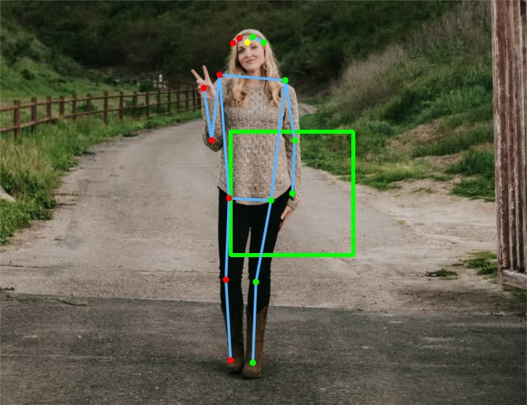
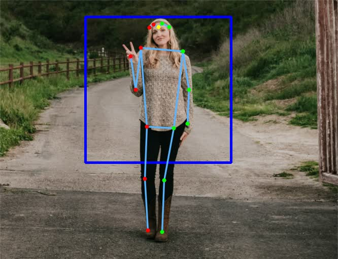
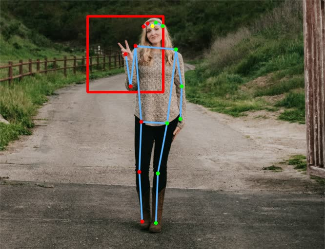
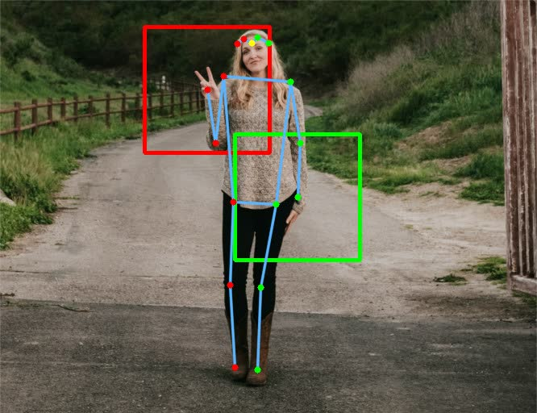

# Hand focusing

### What ?
Find a square zone around one or both hands.

### Why ?
In a hand tracker like https://github.com/geaxgx/depthai_hand_tracker, a palm detector is first run on the image in order to precisely find hands then passes oriented bounding boxes to a landmark regressor. Typically, the palm detector is trained to detect hands that are at a distance from the camera between 1 and 2 meters. So if the person stands further away, it is likely that his hands will not be detected. A body pose estimator can be used to focus on a zone of the image that contains one hand or both hands. So instead of feeding the palm detector with the whole image, we just use the cropped image of the zone.
As the palm detector takes square images as input, the zones around the hands are also square.

### How ?
Movenet gives the wrist keypoints, which are used as the center of the zones we are looking for. Several options are possible given by the **focus** parameter, illustrated in the table balow. 

The size of the square zone is calculated from visible segment lengths. The **scale** parameter can be used to increase/decrease the zone size (> 1.0 to increase, < 1.0 to increase).

With the **hands_up_only** parameter, we take into consideration only the hands where the wrist keypoint is above the elbow keypoint. Indeed, when we want to recognize hand gestures, the arm is generally folded and the hand up.


## Usage

```
-> python demo.py -h
usage: demo.py [-h] [-m {lightning,thunder}]
               [-f {left,right,group,higher,left_right}] [-s SCALE] [-u] [-c]
               [-nsc] [-i INPUT] [-o OUTPUT]

optional arguments:
  -h, --help            show this help message and exit
  -m {lightning,thunder}, --model {lightning,thunder}
                        Model to use (default=thunder)
  -f {left,right,group,higher,left_right}, --focus {left,right,group,higher,left_right}
                        Find square zone(s) around hand(s) (default=higher)
  -s SCALE, --scale SCALE
                        Zone scaling factor (default=1.000000)
  -u, --hands_up_only   Take into considerations only the hands where the
                        wrist is above the elbow
  -c, --crop            Center cropping frames to a square shape (smaller size
                        of original frame)
  -nsc, --no_smart_crop
                        Disable smart cropping from previous frame detection
  -i INPUT, --input INPUT
                        'rgb' or 'rgb_laconic' or path to video/image file to
                        use as input (default: rgb)
  -o OUTPUT, --output OUTPUT
                        Path to output video file

```


|Focus parameter|Result|Comment|
|-|-|-|
|left||Zone around the left hand|
|right||Zone around the right hand|
|group||Zone around both hands|
|higher||Zone around the hand closer to the top|
|left_right||2 zones, one for each hand|
